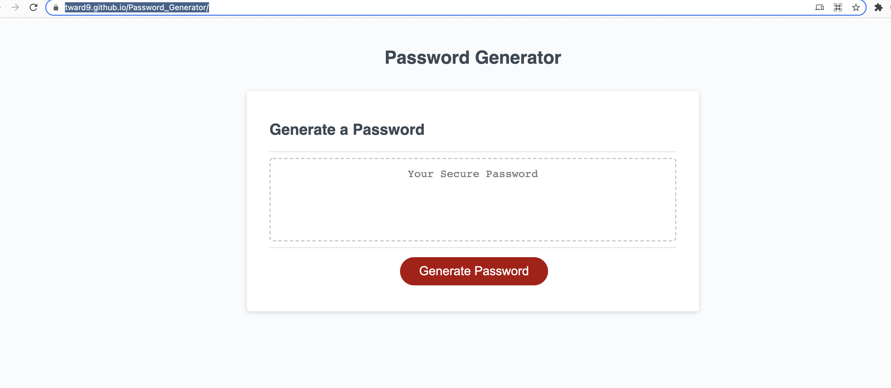

# Password Generator Page

## Description

The goal with this project was to create a function and add it to existing code that prompts the user to select criteria for a password before generating and displaying a random password that matches those criteria. The application runs natively in the browser and updates the page with the password result when the program completes.

As a result, the user can generate any number of random passwords with varying criteria to be copy and pasted elsewhere for use. The options that the user can choose from are length from 8 to 128 characters, lowercase letters, uppercase letters, numbers, and [special characters](https://www.owasp.org/index.php/Password_special_characters).

## Usage

See the deployed application [here](https://tward9.github.io/Password_Generator/)

When opened, you should see the below image:

## Credits

Original Code and images came from the [NU Coding Bootcamp Gitlab](https://nu.bootcampcontent.com/NU-Coding-Bootcamp/NU-VIRT-FSF-PT-01-2022-U-LOL)

